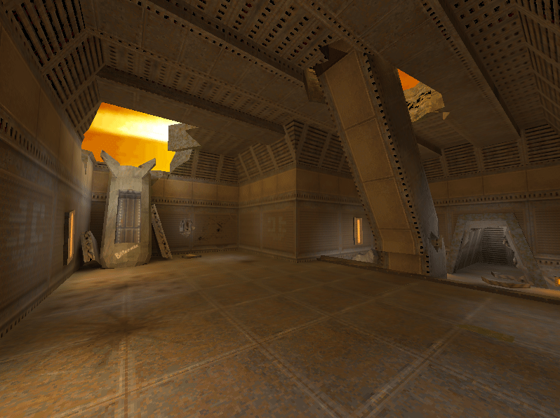
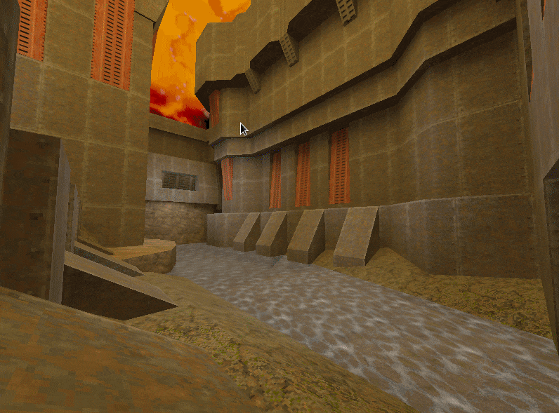
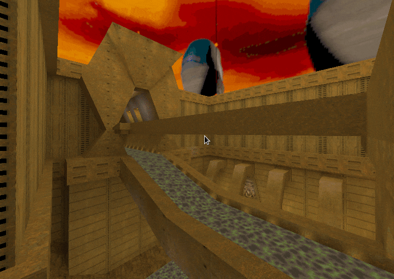
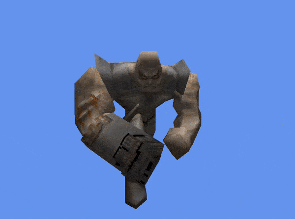

# Quake 2 Level and Model viewer
This project contains a cross-platform Quake 2 .bsp and .md2 viewers based on .NET Core 3 and [Veldrid](https://github.com/mellinoe/veldrid).

---

### Q2Viewer - view .bsp files


Supported map features:
* Texture loading from PAKs
* Lightmaps (they're combined into atlas for efficient rendering)
* Light styles (blinking lights, etc.)
* Warping textures
* Flowing textures
* Skyboxes (PCX only)

Camera controls:
* W/A/S/D/Q/E to move
* Arrow keys (or hold LMB/RMB) to rotate
* Shift increases movement speed, Ctrl decreases it

Hotkeys:
* F: Show wireframe (including triggers)
* G: Show gizmo (three colored axes at origin)
* 1: Normal mode
* 2: Non-textured mode (randomly colored)
* 3: Collision volume display mode (brushes)





#### How to use:
```
  -m, --map     Required. Path to a .bsp map
  -p, --paks    List of paths to .pak files
```

Note - the code is a little bit non-straightforward and non-idiomatic because it's optimized to pursue the following qualities:
* Minimal state switching - faces are grouped by their diffuse texture to minimize costly GPU state switches;
* Skipping non-visible geometry - the face groups' AABBs are checked against the frustum;
* Controllable memory allocation - some things are stack-allocated, and there are two custom allocators:
	* **DirectHeapMemoryAllocator** allocates arrays in the unmanaged heap to ensure they won't end up in LOH, they're wrapped in a struct which implements Dispose to free them;
	* **SharedArrayPoolAllocator** reuses an existing array from a shared array pool - it's mostly used in hot paths.

---
### MD2Viewer - view .md2 files


Loads and renders an animated MD2 model file. Frames are played sequentally.

The frames are packed in to a texture (this technique is often called 'Vertex Animation Texture') and automatically interpolated by the GPU using linear sampling.

Camera controls are the same as above.


#### How to use:
```
  -m, --model    Required. Path to a .md2 model
  -p, --paks     List of paths to .pak files
```


---
### Notes
Check ```Tests/FILE_SAMPLES.txt``` for information about data files used in the tests.

All trademarks are properties of their respective owners.